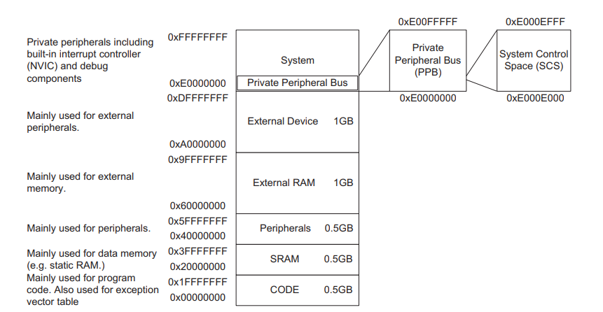

# Preguntas orientadoras
## 1.- Describa brevemente los diferentes perfiles de familias de microprocesadores/microcontroladores de ARM. Explique alguna de sus diferencias características.

1. **Cortex A:**
    - Diseñada para aplicaciones de procesamiento intensivo, como sistemas embebidos complejos, dispositivos móviles, sistemas de entretenimiento y más.
    - Soporte para sistemas operativos completos como Linux, Android, etc.
    - Ofrece una amplia gama de características, incluyendo múltiples núcleos, SIMD (NEON), caché, memoria grande, y potencia de procesamiento significativa.
    - Se enfoca en aplicaciones que requieren un alto rendimiento de procesamiento, con potencia y complejidad asociadas.
2. **Cortex R:**
    - Orientada a sistemas en tiempo real y críticos para la seguridad, como sistemas de control en tiempo real, sistemas de automoción, sistemas médicos, etc.
    - Ofrece capacidades de alta confiabilidad, baja latencia y funciones de seguridad integradas.
    - Está diseñada para garantizar una ejecución determinista y fiable en sistemas que necesitan respuesta en tiempo real y alta disponibilidad.
3. **Cortex M:**
    - Diseñada para sistemas embebidos de baja potencia y tiempo real, ampliamente utilizada en microcontroladores para una variedad de aplicaciones.
    - Ofrece un equilibrio entre rendimiento y eficiencia energética, adecuado para aplicaciones de electrónica de consumo, dispositivos médicos, automoción, etc.
    - Enfocada en aplicaciones que requieren baja potencia y alta eficiencia energética, sin comprometer el rendimiento en tareas en tiempo real.

# Cortex M

## 1.- Describa brevemente las diferencias entre las familias de procesadores Cortex M0, M3 y M4.

- **Cortex M0:** Utiliza una arquitectura de datos de Von Neumann, donde las instrucciones y los datos comparten la misma memoria principal. Basado en la arquitectura ARMv6-M. Utiliza el conjunto de instrucciones Thumb, incluyendo Thumb-1 y Thumb-2, que son instrucciones de 16 y 32 bits respectivamente. No tiene soporte para instrucciones de punto flotante.
- **Cortex M3:** Utiliza una arquitectura de datos de Harvard modificado, donde las instrucciones y los datos están en memorias separadas, pero comparten el mismo espacio de direcciones. Basado en la arquitectura ARMv7-M. Utiliza principalmente el conjunto de instrucciones Thumb-2, que incluye instrucciones de 16 y 32 bits, lo que mejora la densidad de código y el rendimiento. No tiene soporte para instrucciones de punto flotante en la configuración base, pero puede incluir una FPU en implementaciones opcionales.
- **Cortex M4:** Al igual que el Cortex-M3, utiliza una arquitectura de datos de Harvard modificado. Basado en la arquitectura ARMv7-M. Utiliza principalmente el conjunto de instrucciones Thumb-2, con extensiones DSP (procesamiento de señales digitales) y SIMD (NEON) para mejoras de rendimiento. Incluye instrucciones de punto flotante en Thumb-2 y puede incluir una unidad de punto flotante (FPU) en implementaciones opcionales para operaciones de punto flotante más rápidas.

### Caracteristicas adicionales de los Cortex M3 y M4

Desde un punto de vista de alto nivel, Cortex M3 y M4 son muy similares entre sí. Aunque hay diferencias significativas en los diseños de la ruta de datos internas, algunas partes de los procesadores, como el búfer de obtención de instrucciones
decodificación y ejecución de instrucciones, y el NVIC son similares entre sí.
Además, los componentes fuera del nivel del "núcleo" son casi idénticos.
A continuación, se presenta un diagrama de bloques generalizado de los cortex M3 y M4.

El nivel superior de procesadores Cortex M3/M4 tiene varias interfaces de bus que se describen en la siguiente tabla.

## 2.- ¿Por qué se dice que el set de instrucciones Thumb permite mayor densidad de código? Explique
Los procesadores cortex M3 y M4 cuentan con la tecnologia THUMB-2 la cual permite mezclar instrucciones de 16 y 32 bits.
El porque permite la mayor densidad de codigo se debe a:
- En los clasicos procesadores ARM el procesador tenia dos estado de operacion; 32-bit ARM y 16-bit Thumb. Donde en una era soportada las instrucciones de 32 bits y en la otra las instrucciones de 16 bits. El cambio entre estados de operacion del procesador, provocaba que el tiempo de obtencion y ejecucion de instrucciones demore mas, adicional que las instrucciones de 32-bit ARM, ocupaban un mayor espacio en la memoria de programa. 
- Con las instrucciones clasicas, se tenia que especificar el estado del procesador antes de escribir la instruccion en el codigo fuente.
- Al implementar Thumb-2 se obtiene instrucciones optimizadas y velocidad, ademas que ya no se tendra que hacer el cambio de estado del procesador, logrando eficiencia y rendimiento al mismo tiempo.
- Las instrucciones Thumb son más cortas en longitud que las instrucciones ARM de 32 bits, lo que reduce la cantidad de memoria necesaria para almacenar el código. Cada instrucción Thumb es de 16 bits en longitud, mientras que las instrucciones ARM son de 32 bits.
- La estructura compacta de las instrucciones Thumb permite empaquetar más instrucciones en la misma cantidad de memoria.

## 3.- ¿Qué entiende por arquitectura load-store? ¿Qué tipo de instrucciones no posee este tipo de arquitectura?
Esto significa que los datos deben cargarse desde la memoria, procesarse y escribirse de nuevo en la memoria mediante una seria de instrucciones. Por ejemplo, si deseamos incrementar un valor de datos almacenado en la SRAM el procedimiento es el siguiente:
- Procesador necesita una instruccion para leer los datos de la SRAM y colocarlos en los registros de proposito general del procesador.
- Se necesita una segunda instruccion para aumentar el valor que ya esta almacenado en los registros del procesador.
- Se necesita una tercera instruccion para escribir el nuevo valor en la memoria SRAM.
Esta arquitectura no posee instrucciones donde se requiera operar directamente sobre datos almacenados en la memoria. Por ejemplo.
~~~
ADD [dirección], R1, R2   ; Sumar el contenido de la dirección con el contenido de R1 y almacenar el resultado en memoria
~~~
En lugar de eso, primero se debe cargar el contenido de la dirección y luego realizar la operación utilizando registros:
~~~
LDR R3, [dirección]       ; Cargar el contenido de la dirección en R3
ADD R3, R1, R2            ; Sumar R1 y R2 y almacenar el resultado en R3
STR R3, [dirección]       ; Almacenar el resultado en la dirección
~~~

## 4.- ¿Cómo es el mapa de memoria de la familia?
El espacio de direcciones de 4 GB de los procesadores Cortex M está dividido en varias regiones de memoria.
- Accesos a código de programa (por ejemplo, región CODE)
- Accesos a datos (por ejemplo, región SRAM)
- Periféricos (por ejemplo, región de periféricos)
- Control interno del procesador y componentes de depuración (por ejemplo, Private Peripheral Bus)
La arquitectura también permite una alta flexibilidad para que las regiones de memoria se utilicen para otros propósitos. Por ejemplo, los programas pueden ejecutarse tanto desde la región de CÓDIGO como desde la de RAM (SRAM), y un microcontrolador también puede integrar bloques de SRAM en la región de CÓDIGO.

## 6.- Describa los diferentes modos de privilegio y operación del Cortex M, sus relaciones y como se conmuta de uno al otro. Describa un ejemplo en el que se pasa del modo privilegiado a no priviligiado y nuevamente a privilegiado.

Los procesadores Cortex-M3 y Cortex-M4 disponen de punteros apilados en bancos:
- El kernel del SO y las interrupciones: Utiliza el Main Stack Pointer (MSP)
- Tareas de aplicación: Se utiliza el puntero de pila de procesos (PSP). 

De este modo, la pila utilizada por el kernel del SO puede separarse de la que utilizan las tareas de aplicación, lo que mejora la fiabilidad así como permitir un uso óptimo del espacio de pila. 
 **Para aplicaciones sencillas sin SO, el MSP se puede utilizar todo el tiempo.**

Para mejorar aún más la confiabilidad del sistema, el cortex M3 y M4 admiten la separación de modos de operación privilegiados y no privilegiados. De forma predeterminada, los procesadores se inician en modo privilegiado.

Cuando se utiliza un sistema operativo y se ejecutan tareas de usuario, la ejecución de las tareas de usuario se puede llevar a cabo en modo no privilegiado para que se puedan aplicar ciertas restricciones, como bloquear el acceso a agunos registros NVIC. 

La separación de modos de operación también se puede utilizar con la MPU para evitar que tareas sin privilegios accedan a ciertas regiones de la memoria. De esta manera, una tarea de usuario no pueda dañar los datos utilizados por el Kernel del sistema operativo u otras tareas, mejorando asi la estabilidad del sistema.

### Modos de privilegios, operación y estados.

- **Estados de operación:**
    - **Thumb State:** Cuando el procesador está ejecutando código de programa.
    - **Debug State:** Cuando el procesador está detenido o no ejecuta instrucciones debido al depurador o breakpoints
- **Modos de operación:** 
    - **Handler Mode:** Al ejecutar un controlador de excepciones como una rutina de servicio de interrupción (ISR). En modo Handler, el procesador tiene un nivel de acceso privilegiado.
    - **Thread Mode:** Al ejecutar un código de aplicación normal, en este modo, el procesador puede estar en un nivel de acceso privilegiado como no privilegiado. Esto se controla por un registro especial denonimado *CONTROL*.
- **Nivel de acceso:**
    - **Privilegiado:** El procesador tiene acceso a todos los recursos. 
    - **No privilegiado:** Algunas regiones de memoria son inaccesibles para el procesador y algunas operaciones no pueden ser usadas.

    