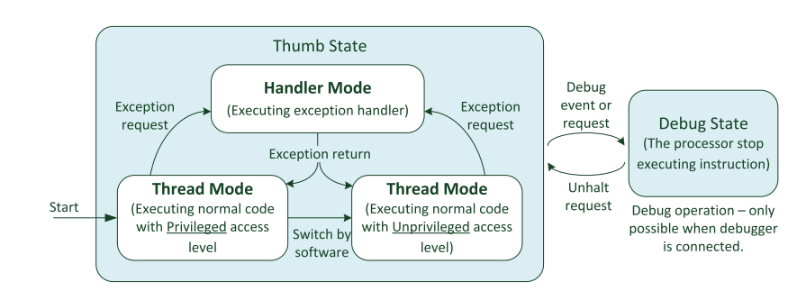
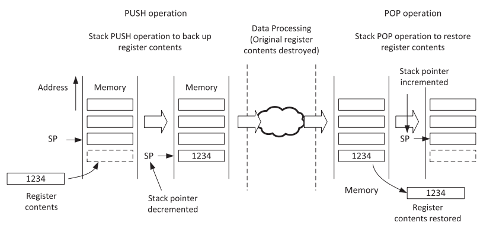

# Preguntas orientadoras
## 1.- Describa brevemente los diferentes perfiles de familias de microprocesadores/microcontroladores de ARM. Explique alguna de sus diferencias características.

1. **Cortex A:**
    - Diseñada para aplicaciones de procesamiento intensivo, como sistemas embebidos complejos, dispositivos móviles, sistemas de entretenimiento y más.
    - Soporte para sistemas operativos completos como Linux, Android, etc.
    - Ofrece una amplia gama de características, incluyendo múltiples núcleos, SIMD (NEON), caché, memoria grande, y potencia de procesamiento significativa.
    - Se enfoca en aplicaciones que requieren un alto rendimiento de procesamiento, con potencia y complejidad asociadas.
2. **Cortex R:**
    - Orientada a sistemas en tiempo real y críticos para la seguridad, como sistemas de control en tiempo real, sistemas de automoción, sistemas médicos, etc.
    - Ofrece capacidades de alta confiabilidad, baja latencia y funciones de seguridad integradas.
    - Está diseñada para garantizar una ejecución determinista y fiable en sistemas que necesitan respuesta en tiempo real y alta disponibilidad.
3. **Cortex M:**
    - Diseñada para sistemas embebidos de baja potencia y tiempo real, ampliamente utilizada en microcontroladores para una variedad de aplicaciones.
    - Ofrece un equilibrio entre rendimiento y eficiencia energética, adecuado para aplicaciones de electrónica de consumo, dispositivos médicos, automoción, etc.
    - Enfocada en aplicaciones que requieren baja potencia y alta eficiencia energética, sin comprometer el rendimiento en tareas en tiempo real.

# Cortex M

## 1.- Describa brevemente las diferencias entre las familias de procesadores Cortex M0, M3 y M4.

- **Cortex M0:** Utiliza una arquitectura de datos de Von Neumann, donde las instrucciones y los datos comparten la misma memoria principal. Basado en la arquitectura ARMv6-M. Utiliza el conjunto de instrucciones Thumb, incluyendo Thumb-1 y Thumb-2, que son instrucciones de 16 y 32 bits respectivamente. No tiene soporte para instrucciones de punto flotante.
- **Cortex M3:** Utiliza una arquitectura de datos de Harvard modificado, donde las instrucciones y los datos están en memorias separadas, pero comparten el mismo espacio de direcciones. Basado en la arquitectura ARMv7-M. Utiliza principalmente el conjunto de instrucciones Thumb-2, que incluye instrucciones de 16 y 32 bits, lo que mejora la densidad de código y el rendimiento. No tiene soporte para instrucciones de punto flotante en la configuración base, pero puede incluir una FPU en implementaciones opcionales.
- **Cortex M4:** Al igual que el Cortex-M3, utiliza una arquitectura de datos de Harvard modificado. Basado en la arquitectura ARMv7-M. Utiliza principalmente el conjunto de instrucciones Thumb-2, con extensiones DSP (procesamiento de señales digitales) y SIMD (NEON) para mejoras de rendimiento. Incluye instrucciones de punto flotante en Thumb-2 y puede incluir una unidad de punto flotante (FPU) en implementaciones opcionales para operaciones de punto flotante más rápidas.

### Caracteristicas adicionales de los Cortex M3 y M4

Desde un punto de vista de alto nivel, Cortex M3 y M4 son muy similares entre sí. Aunque hay diferencias significativas en los diseños de la ruta de datos internas, algunas partes de los procesadores, como el búfer de obtención de instrucciones
decodificación y ejecución de instrucciones, y el NVIC son similares entre sí.
Además, los componentes fuera del nivel del "núcleo" son casi idénticos.
A continuación, se presenta un diagrama de bloques generalizado de los cortex M3 y M4.

El nivel superior de procesadores Cortex M3/M4 tiene varias interfaces de bus que se describen en la siguiente tabla.

## 2.- ¿Por qué se dice que el set de instrucciones Thumb permite mayor densidad de código? Explique
Los procesadores cortex M3 y M4 cuentan con la tecnologia THUMB-2 la cual permite mezclar instrucciones de 16 y 32 bits.
El porque permite la mayor densidad de codigo se debe a:
- En los clasicos procesadores ARM el procesador tenia dos estado de operacion; 32-bit ARM y 16-bit Thumb. Donde en una era soportada las instrucciones de 32 bits y en la otra las instrucciones de 16 bits. El cambio entre estados de operacion del procesador, provocaba que el tiempo de obtencion y ejecucion de instrucciones demore mas, adicional que las instrucciones de 32-bit ARM, ocupaban un mayor espacio en la memoria de programa. 
- Con las instrucciones clasicas, se tenia que especificar el estado del procesador antes de escribir la instruccion en el codigo fuente.
- Al implementar Thumb-2 se obtiene instrucciones optimizadas y velocidad, ademas que ya no se tendra que hacer el cambio de estado del procesador, logrando eficiencia y rendimiento al mismo tiempo.
- Las instrucciones Thumb son más cortas en longitud que las instrucciones ARM de 32 bits, lo que reduce la cantidad de memoria necesaria para almacenar el código. Cada instrucción Thumb es de 16 bits en longitud, mientras que las instrucciones ARM son de 32 bits.
- La estructura compacta de las instrucciones Thumb permite empaquetar más instrucciones en la misma cantidad de memoria.

## 3.- ¿Qué entiende por arquitectura load-store? ¿Qué tipo de instrucciones no posee este tipo de arquitectura?
Esto significa que los datos deben cargarse desde la memoria, procesarse y escribirse de nuevo en la memoria mediante una seria de instrucciones. Por ejemplo, si deseamos incrementar un valor de datos almacenado en la SRAM el procedimiento es el siguiente:
- Procesador necesita una instruccion para leer los datos de la SRAM y colocarlos en los registros de proposito general del procesador.
- Se necesita una segunda instruccion para aumentar el valor que ya esta almacenado en los registros del procesador.
- Se necesita una tercera instruccion para escribir el nuevo valor en la memoria SRAM.
Esta arquitectura no posee instrucciones donde se requiera operar directamente sobre datos almacenados en la memoria. Por ejemplo.
~~~
ADD [dirección], R1, R2   ; Sumar el contenido de la dirección con el contenido de R1 y almacenar el resultado en memoria
~~~
En lugar de eso, primero se debe cargar el contenido de la dirección y luego realizar la operación utilizando registros:
~~~
LDR R3, [dirección]       ; Cargar el contenido de la dirección en R3
ADD R3, R1, R2            ; Sumar R1 y R2 y almacenar el resultado en R3
STR R3, [dirección]       ; Almacenar el resultado en la dirección
~~~

## 4.- ¿Cómo es el mapa de memoria de la familia?
El espacio de direcciones de 4 GB de los procesadores Cortex M está dividido en varias regiones de memoria.
- Accesos a código de programa (por ejemplo, región CODE)
- Accesos a datos (por ejemplo, región SRAM)
- Periféricos (por ejemplo, región de periféricos)
- Control interno del procesador y componentes de depuración (por ejemplo, Private Peripheral Bus)
La arquitectura también permite una alta flexibilidad para que las regiones de memoria se utilicen para otros propósitos. Por ejemplo, los programas pueden ejecutarse tanto desde la región de CÓDIGO como desde la de RAM (SRAM), y un microcontrolador también puede integrar bloques de SRAM en la región de CÓDIGO.

## 5.- ¿Qué ventajas presenta el uso de los “shadowed pointers” del PSP y el MSP?
En el contexto de los microcontroladores Cortex-M4, los "shadowed pointers" se refieren a la técnica de utilizar dos punteros, el Process Stack Pointer (PSP) y el Main Stack Pointer (MSP), para administrar y trabajar con las pilas en un entorno multitarea. Estos punteros permiten cambiar eficientemente entre el contexto de ejecución principal y los contextos de ejecución de procesos o tareas. A continuación, se mencionan algunas ventajas de utilizar los "shadowed pointers" PSP y MSP en un Cortex-M4:
- **Gestión eficiente de la memoria:** El uso de dos punteros de pila (PSP y MSP) permite una administración eficiente de la memoria al separar la pila principal (MSP) utilizada por el sistema y la pila de procesos (PSP) utilizada por las tareas.
- **Soporte para multitarea:** Los "shadowed pointers" facilitan la conmutación entre tareas o procesos en un sistema multitarea. Cada tarea puede tener su propia pila asociada (utilizando el PSP) mientras que el sistema y las interrupciones se gestionan utilizando la pila principal (MSP).
- **Cambios de contexto rápidos:** Al usar PSP y MSP, es posible cambiar de una tarea a otra de manera rápida y eficiente, ya que solo es necesario cambiar el puntero de la pila (PSP) en lugar de modificar la pila real.

## 6.- Describa los diferentes modos de privilegio y operación del Cortex M, sus relaciones y como se conmuta de uno al otro. Describa un ejemplo en el que se pasa del modo privilegiado a no priviligiado y nuevamente a privilegiado.

Los procesadores Cortex-M3 y Cortex-M4 disponen de punteros apilados en bancos:
- El kernel del SO y las interrupciones: Utiliza el Main Stack Pointer (MSP)
- Tareas de aplicación: Se utiliza el puntero de pila de procesos (PSP). 

De este modo, la pila utilizada por el kernel del SO puede separarse de la que utilizan las tareas de aplicación, lo que mejora la fiabilidad así como permitir un uso óptimo del espacio de pila. 
 **Para aplicaciones sencillas sin SO, el MSP se puede utilizar todo el tiempo.**

Para mejorar aún más la confiabilidad del sistema, el cortex M3 y M4 admiten la separación de modos de operación privilegiados y no privilegiados. De forma predeterminada, los procesadores se inician en modo privilegiado.

Cuando se utiliza un sistema operativo y se ejecutan tareas de usuario, la ejecución de las tareas de usuario se puede llevar a cabo en modo no privilegiado para que se puedan aplicar ciertas restricciones, como bloquear el acceso a algunos registros NVIC. 

La separación de modos de operación también se puede utilizar con la MPU para evitar que tareas sin privilegios accedan a ciertas regiones de la memoria. De esta manera, una tarea de usuario no pueda dañar los datos utilizados por el Kernel del sistema operativo u otras tareas, mejorando asi la estabilidad del sistema.

### Modos de privilegios, operación y estados.

- **Estados de operación:**
    - **Thumb State:** Cuando el procesador está ejecutando código de programa.
    - **Debug State:** Cuando el procesador está detenido o no ejecuta instrucciones debido al depurador o breakpoints
- **Modos de operación:** 
    - **Handler Mode:** Al ejecutar un controlador de excepciones como una rutina de servicio de interrupción (ISR). En modo Handler, el procesador tiene un nivel de acceso privilegiado.
    - **Thread Mode:** Al ejecutar un código de aplicación normal, en este modo, el procesador puede estar en un nivel de acceso privilegiado como no privilegiado. Esto se controla por un registro especial denonimado *CONTROL*.
- **Nivel de acceso:**
    - **Privilegiado:** El procesador tiene acceso a todos los recursos. 
    - **No privilegiado:** Algunas regiones de memoria son inaccesibles para el procesador y algunas operaciones no pueden ser usadas.

 En la siguiente figura podemos observar que en *Thread Mode* podemos cambiar de modo privilegiado a no privilegiado. Sin embargo no es posible hacer lo contrario, para esto, se necesita usar un mecanismo que permita saltar a una excepción, el cual será manejado por el *Handler Mode*. De esta forma podemos tener cualquier nivel de acceso.

**Ejemplo**: Un sistema embebido puede contener un kernel de sistema operativo integrado que se ejecuta con un nivel de acceso privilegiado y tareas de aplicación que se ejecutan en no privilegiado. De esta forma, si una tarea falla, las tareas restantes y el kernel de la aplicación aun pueden continuar ejecutándose normalmente, protegiendo así zonas de memoria y periféricos. 

## 7.- ¿Qué se entiende por modelo de registros ortogonal? Dé un ejemplo

El término "modelo de registros ortogonal" en el contexto de los microcontroladores Cortex-M4 se refiere a la característica de la arquitectura donde los registros tienen un propósito específico y bien definido, lo que significa que cada registro tiene una función clara y no se superponen en su uso o función.

En el caso del Cortex-M4, el diseño de la arquitectura de registros es altamente eficiente y se busca minimizar la redundancia o superposición de funciones entre los registros. Por ejemplo, se pueden tener registros específicos para propósitos generales, registros de estado, registros de control y registros especializados para ciertas operaciones. Esto permite un uso más eficiente y organizado de los registros en la ejecución de instrucciones y operaciones del procesador.

Un ejemplo de modelo de registros ortogonal en el Cortex-M4 es el uso de registros específicos para operaciones aritméticas, como la multiplicación y la división. Por ejemplo, los registros R0 y R1 pueden utilizarse para almacenar operandos, mientras que los registros R2 y R3 pueden usarse para almacenar los resultados de operaciones aritméticas. Esto proporciona un diseño claro y específico para las operaciones matemáticas, separando claramente los registros involucrados en estas operaciones de otros registros que pueden tener diferentes propósitos.

Por lo tanto, en resumen, el modelo de registros ortogonal en el Cortex-M4 se refiere a un diseño donde cada registro tiene un propósito específico y claro, evitando la superposición de funciones y permitiendo un uso eficiente y organizado de los registros en el procesador.

## 8.- ¿Qué ventajas presenta el uso de intrucciones de ejecución condicional (IT)? Dé un ejemplo

## 9.- Describa brevemente las excepciones más prioritarias (reset, NMI, Hardfault).

- **Reset:** 
   - Prioridad máxima: Es la excepción más prioritaria y se produce al encender o reiniciar el microcontrolador.
    - Función: Inicializa el sistema, establece valores predeterminados para registros, inicializa la memoria y pone en marcha el programa principal.

- **NMI (Non-Maskable Interrupt):**

    - Prioridad alta: Es una excepción no enmascarable que tiene una prioridad alta, no puede ser deshabilitada y siempre es atendida.
    - Función: Utilizada para eventos críticos y de alta prioridad que deben ser atendidos de inmediato, incluso si otras interrupciones están deshabilitadas.

- **Hard Fault:**

    - Prioridad alta: Es una excepción de alta prioridad, aunque su prioridad exacta puede variar según la configuración específica.
    - Función: Ocurre cuando se detecta un error grave o una condición inesperada durante la ejecución, como un acceso indebido a memoria o una instrucción no válida.

Estas excepciones son críticas para garantizar la estabilidad y la integridad del sistema. El reset inicializa el sistema, la NMI maneja eventos cruciales que deben atenderse en cualquier situación y el hard fault atiende condiciones inesperadas que podrían llevar a un comportamiento inadecuado o a un bloqueo del sistema. Es fundamental comprender y manejar estas excepciones de manera adecuada en el diseño y la programación de sistemas basados en Cortex-M4.

## 10.- Describa las funciones principales de la pila. ¿Cómo resuelve la arquitectura el llamado a funciones y su retorno?

### Stack Memory
El *stack* es un mecanismo de uso de memoria que permite que una porcion de la memoria se utilice como buffer del almacenamiento de datos donde el ultimo dato en entrar es el primero en salir (LIFO).

ARM utiliza la memoria principal del sistema para operaciones del *stack de memoria*. Tiene instrucciones **PUSH** para almacenar datos en la pila y la instruccion **POP** para recuperar los datos de la pila. Es importante tener en cuenta que el *Stack Pointer* que se esta utilizando es automaticamente ajustado por cada instruccion **PUSH** y **POP**.

La pila o *stack* puede ser usado para:

- Almacenamiento temporal de datos originales cuando una funcion en ejecucion necesita utilizar registros del banco de registros para el procesamiento de datos.
- Los valores se pueden restaurar al final de la funcion para que el programa que llamo a la funcion no pierda los datos.
- Pasar informacion a rutinas y subrutinas.
- Para almacenamiento de variables locales.
- Para mantener los valores de estado y registros del procesador en el caso de excepciones como una interrupcion. 

Cuando se inicia el procesador, el *STACK POINTER* (SP) se configura al final del espacio de memoria reservado para el *stack memory*. 

- Por cada *PUSH*, el procesador primero decrementa el SP, luego almacena el valor en la ubicacion de memoria referenciado por el SP.
- Durante las operaciones, el SP apunta a la ubicacion de la memoria donde se enviaron los ultimos datos a la pila.
- En una operacion *POP*, el valor de la ubicacion de memoria apuntado por SP es leido y luego, el valor del SP incrementa automaticamente. 

Los usos mas comunes de la instrucciones *Push* y *Pop* son para guardar el contenido del banco de registros cuando una funcion o subrutina es llamada. Al inicio de la llamada, el contenido de algunos registros pueden ser guardados en el *stack* usando un *PUSH*, y luego puede ser restaurado a su valor original, cuando se complete la funcion o subrutina, utilizando un *POP*.

A continuacion se dara un ejemplo, donde se ejecuta una funcion denominada *Funcion 1* llamada desde el programa principal.

- La funcion 1 va a necesitar usar y modificar los registros R4, R5 y R6 para el procesamiento de datos, y estos registros contienen valores que el programa principal necesitara mas adelante. Estos deben ser almacenados en el *Stack* usando un *PUSH* y luego ser restaurados usando un *POP* al final de la funcion 1.

- De esta forma, el codigo del programa que llama a la funcion no va a perder ningun dato y podra continuar con una ejecucion normal. 

- Es importante notar que cada instruccion *PUSH* tiene su instruccion *POP*.

## 11.- Describa la secuencia de reset del microprocesador.

Despues del reset y antes que el procesador inicie la ejecucion del programa, el procesador lee las primeras dos palabras desde la memoria. 

El comienzo del espacio de memoria contiene la tabla de vectores y las dos primeras palabras de la tabla de vectores son el valor inicial del MSP y el vector de reinicio, que es la direccion inicial del controlador de reinicio. Despues de que el procesador lee estas dos palabras, el procesador configura el MSP y el contador de programa con estos valores.

La configuración del MSP es necesaria porque algunas excepciones, como el manejador de NMI (interrupción no enmascarable) o el manejador de HardFault (fallo grave), podrían ocurrir potencialmente poco después del reinicio, y la memoria de pila y, por lo tanto, el MSP, serán necesarios para empujar parte del estado del procesador a la pila antes de manejar la excepción. 

## 18.- ¿Qué funciones cumple la unidad de protección de memoria (MPU)?
Es una unidad programable la cual define permisos de acceso para varias regiones de memoria. En los Cortex M3 y M4 admite 8 regiones programables y pueden utilizarse con un sistema operativo integrado para proporcionar un sistema robusto.