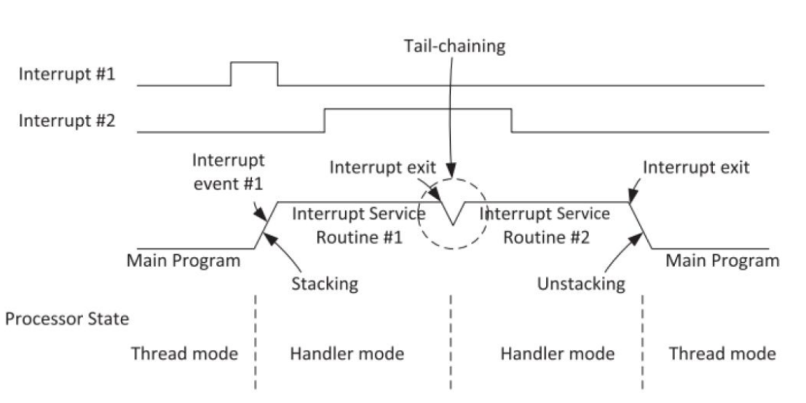
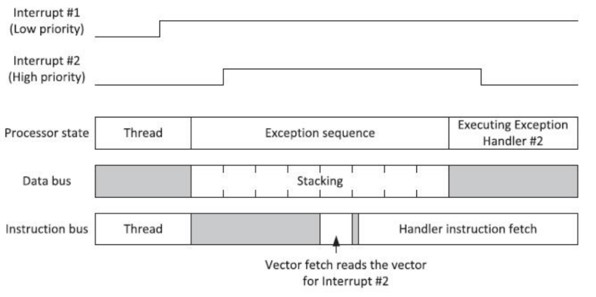
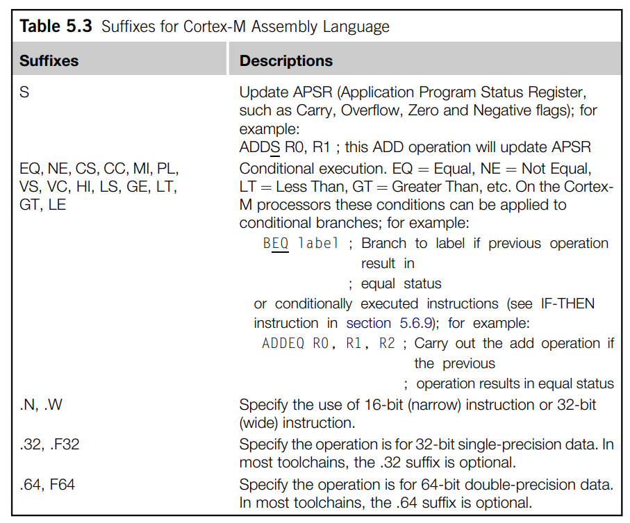
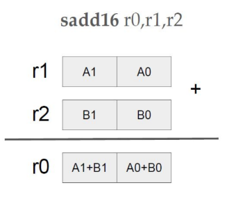

# Preguntas orientadoras
## 1.- Describa brevemente los diferentes perfiles de familias de microprocesadores/microcontroladores de ARM. Explique alguna de sus diferencias características.

1. **Cortex A:**
    - Diseñada para aplicaciones de procesamiento intensivo, como sistemas embebidos complejos, dispositivos móviles, sistemas de entretenimiento y más.
    - Soporte para sistemas operativos completos como Linux, Android, etc.
    - Ofrece una amplia gama de características, incluyendo múltiples núcleos, SIMD (NEON), caché, memoria grande, y potencia de procesamiento significativa.
    - Se enfoca en aplicaciones que requieren un alto rendimiento de procesamiento, con potencia y complejidad asociadas.
2. **Cortex R:**
    - Orientada a sistemas en tiempo real y críticos para la seguridad, como sistemas de control en tiempo real, sistemas de automoción, sistemas médicos, etc.
    - Ofrece capacidades de alta confiabilidad, baja latencia y funciones de seguridad integradas.
    - Está diseñada para garantizar una ejecución determinista y fiable en sistemas que necesitan respuesta en tiempo real y alta disponibilidad.
3. **Cortex M:**
    - Diseñada para sistemas embebidos de baja potencia y tiempo real, ampliamente utilizada en microcontroladores para una variedad de aplicaciones.
    - Ofrece un equilibrio entre rendimiento y eficiencia energética, adecuado para aplicaciones de electrónica de consumo, dispositivos médicos, automoción, etc.
    - Enfocada en aplicaciones que requieren baja potencia y alta eficiencia energética, sin comprometer el rendimiento en tareas en tiempo real.

# Cortex M

## 1.- Describa brevemente las diferencias entre las familias de procesadores Cortex M0, M3 y M4.

- **Cortex M0:** Utiliza una arquitectura de datos de Von Neumann, donde las instrucciones y los datos comparten la misma memoria principal. Basado en la arquitectura ARMv6-M. Utiliza el conjunto de instrucciones Thumb, incluyendo Thumb-1 y Thumb-2, que son instrucciones de 16 y 32 bits respectivamente. No tiene soporte para instrucciones de punto flotante.
- **Cortex M3:** Utiliza una arquitectura de datos de Harvard modificado, donde las instrucciones y los datos están en memorias separadas, pero comparten el mismo espacio de direcciones. Basado en la arquitectura ARMv7-M. Utiliza principalmente el conjunto de instrucciones Thumb-2, que incluye instrucciones de 16 y 32 bits, lo que mejora la densidad de código y el rendimiento. No tiene soporte para instrucciones de punto flotante en la configuración base, pero puede incluir una FPU en implementaciones opcionales.
- **Cortex M4:** Al igual que el Cortex-M3, utiliza una arquitectura de datos de Harvard modificado. Basado en la arquitectura ARMv7-M. Utiliza principalmente el conjunto de instrucciones Thumb-2, con extensiones DSP (procesamiento de señales digitales) y SIMD (NEON) para mejoras de rendimiento. Incluye instrucciones de punto flotante en Thumb-2 y puede incluir una unidad de punto flotante (FPU) en implementaciones opcionales para operaciones de punto flotante más rápidas.

### Caracteristicas adicionales de los Cortex M3 y M4

Desde un punto de vista de alto nivel, Cortex M3 y M4 son muy similares entre sí. Aunque hay diferencias significativas en los diseños de la ruta de datos internas, algunas partes de los procesadores, como el búfer de obtención de instrucciones
decodificación y ejecución de instrucciones, y el NVIC son similares entre sí.
Además, los componentes fuera del nivel del "núcleo" son casi idénticos.
A continuación, se presenta un diagrama de bloques generalizado de los cortex M3 y M4.

El nivel superior de procesadores Cortex M3/M4 tiene varias interfaces de bus que se describen en la siguiente tabla.

## 2.- ¿Por qué se dice que el set de instrucciones Thumb permite mayor densidad de código? Explique
Los procesadores cortex M3 y M4 cuentan con la tecnologia THUMB-2 la cual permite mezclar instrucciones de 16 y 32 bits.
El porque permite la mayor densidad de codigo se debe a:
- En los clasicos procesadores ARM el procesador tenia dos estado de operacion; 32-bit ARM y 16-bit Thumb. Donde en una era soportada las instrucciones de 32 bits y en la otra las instrucciones de 16 bits. El cambio entre estados de operacion del procesador, provocaba que el tiempo de obtencion y ejecucion de instrucciones demore mas, adicional que las instrucciones de 32-bit ARM, ocupaban un mayor espacio en la memoria de programa. 
- Con las instrucciones clasicas, se tenia que especificar el estado del procesador antes de escribir la instruccion en el codigo fuente.
- Al implementar Thumb-2 se obtiene instrucciones optimizadas y velocidad, ademas que ya no se tendra que hacer el cambio de estado del procesador, logrando eficiencia y rendimiento al mismo tiempo.
- Las instrucciones Thumb son más cortas en longitud que las instrucciones ARM de 32 bits, lo que reduce la cantidad de memoria necesaria para almacenar el código. Cada instrucción Thumb es de 16 bits en longitud, mientras que las instrucciones ARM son de 32 bits.
- La estructura compacta de las instrucciones Thumb permite empaquetar más instrucciones en la misma cantidad de memoria.

## 3.- ¿Qué entiende por arquitectura load-store? ¿Qué tipo de instrucciones no posee este tipo de arquitectura?
Esto significa que los datos deben cargarse desde la memoria, procesarse y escribirse de nuevo en la memoria mediante una seria de instrucciones. Por ejemplo, si deseamos incrementar un valor de datos almacenado en la SRAM el procedimiento es el siguiente:
- Procesador necesita una instruccion para leer los datos de la SRAM y colocarlos en los registros de proposito general del procesador.
- Se necesita una segunda instruccion para aumentar el valor que ya esta almacenado en los registros del procesador.
- Se necesita una tercera instruccion para escribir el nuevo valor en la memoria SRAM.
Esta arquitectura no posee instrucciones donde se requiera operar directamente sobre datos almacenados en la memoria. Por ejemplo.
~~~
ADD [dirección], R1, R2   ; Sumar el contenido de la dirección con el contenido de R1 y almacenar el resultado en memoria
~~~
En lugar de eso, primero se debe cargar el contenido de la dirección y luego realizar la operación utilizando registros:
~~~
LDR R3, [dirección]       ; Cargar el contenido de la dirección en R3
ADD R3, R1, R2            ; Sumar R1 y R2 y almacenar el resultado en R3
STR R3, [dirección]       ; Almacenar el resultado en la dirección
~~~

## 4.- ¿Cómo es el mapa de memoria de la familia?
El espacio de direcciones de 4 GB de los procesadores Cortex M está dividido en varias regiones de memoria.
- Accesos a código de programa (por ejemplo, región CODE)
- Accesos a datos (por ejemplo, región SRAM)
- Periféricos (por ejemplo, región de periféricos)
- Control interno del procesador y componentes de depuración (por ejemplo, Private Peripheral Bus)
La arquitectura también permite una alta flexibilidad para que las regiones de memoria se utilicen para otros propósitos. Por ejemplo, los programas pueden ejecutarse tanto desde la región de CÓDIGO como desde la de RAM (SRAM), y un microcontrolador también puede integrar bloques de SRAM en la región de CÓDIGO.

## 5.- ¿Qué ventajas presenta el uso de los “shadowed pointers” del PSP y el MSP?
En el contexto de los microcontroladores Cortex-M4, los "shadowed pointers" se refieren a la técnica de utilizar dos punteros, el Process Stack Pointer (PSP) y el Main Stack Pointer (MSP), para administrar y trabajar con las pilas en un entorno multitarea. Estos punteros permiten cambiar eficientemente entre el contexto de ejecución principal y los contextos de ejecución de procesos o tareas. A continuación, se mencionan algunas ventajas de utilizar los "shadowed pointers" PSP y MSP en un Cortex-M4:
- **Gestión eficiente de la memoria:** El uso de dos punteros de pila (PSP y MSP) permite una administración eficiente de la memoria al separar la pila principal (MSP) utilizada por el sistema y la pila de procesos (PSP) utilizada por las tareas.
- **Soporte para multitarea:** Los "shadowed pointers" facilitan la conmutación entre tareas o procesos en un sistema multitarea. Cada tarea puede tener su propia pila asociada (utilizando el PSP) mientras que el sistema y las interrupciones se gestionan utilizando la pila principal (MSP).
- **Cambios de contexto rápidos:** Al usar PSP y MSP, es posible cambiar de una tarea a otra de manera rápida y eficiente, ya que solo es necesario cambiar el puntero de la pila (PSP) en lugar de modificar la pila real.

## 6.- Describa los diferentes modos de privilegio y operación del Cortex M, sus relaciones y como se conmuta de uno al otro. Describa un ejemplo en el que se pasa del modo privilegiado a no priviligiado y nuevamente a privilegiado.

Los procesadores Cortex-M3 y Cortex-M4 disponen de punteros apilados en bancos:
- El kernel del SO y las interrupciones: Utiliza el Main Stack Pointer (MSP)
- Tareas de aplicación: Se utiliza el puntero de pila de procesos (PSP). 

De este modo, la pila utilizada por el kernel del SO puede separarse de la que utilizan las tareas de aplicación, lo que mejora la fiabilidad así como permitir un uso óptimo del espacio de pila. 
 **Para aplicaciones sencillas sin SO, el MSP se puede utilizar todo el tiempo.**

Para mejorar aún más la confiabilidad del sistema, el cortex M3 y M4 admiten la separación de modos de operación privilegiados y no privilegiados. De forma predeterminada, los procesadores se inician en modo privilegiado.

Cuando se utiliza un sistema operativo y se ejecutan tareas de usuario, la ejecución de las tareas de usuario se puede llevar a cabo en modo no privilegiado para que se puedan aplicar ciertas restricciones, como bloquear el acceso a algunos registros NVIC. 

La separación de modos de operación también se puede utilizar con la MPU para evitar que tareas sin privilegios accedan a ciertas regiones de la memoria. De esta manera, una tarea de usuario no pueda dañar los datos utilizados por el Kernel del sistema operativo u otras tareas, mejorando asi la estabilidad del sistema.

### Modos de privilegios, operación y estados.

- **Estados de operación:**
    - **Thumb State:** Cuando el procesador está ejecutando código de programa.
    - **Debug State:** Cuando el procesador está detenido o no ejecuta instrucciones debido al depurador o breakpoints
- **Modos de operación:** 
    - **Handler Mode:** Al ejecutar un controlador de excepciones como una rutina de servicio de interrupción (ISR). En modo Handler, el procesador tiene un nivel de acceso privilegiado.
    - **Thread Mode:** Al ejecutar un código de aplicación normal, en este modo, el procesador puede estar en un nivel de acceso privilegiado como no privilegiado. Esto se controla por un registro especial denonimado *CONTROL*.
- **Nivel de acceso:**
    - **Privilegiado:** El procesador tiene acceso a todos los recursos. 
    - **No privilegiado:** Algunas regiones de memoria son inaccesibles para el procesador y algunas operaciones no pueden ser usadas.

 En la siguiente figura podemos observar que en *Thread Mode* podemos cambiar de modo privilegiado a no privilegiado. Sin embargo no es posible hacer lo contrario, para esto, se necesita usar un mecanismo que permita saltar a una excepción, el cual será manejado por el *Handler Mode*. De esta forma podemos tener cualquier nivel de acceso.

**Ejemplo**: Un sistema embebido puede contener un kernel de sistema operativo integrado que se ejecuta con un nivel de acceso privilegiado y tareas de aplicación que se ejecutan en no privilegiado. De esta forma, si una tarea falla, las tareas restantes y el kernel de la aplicación aun pueden continuar ejecutándose normalmente, protegiendo así zonas de memoria y periféricos. 

## 7.- ¿Qué se entiende por modelo de registros ortogonal? Dé un ejemplo

El término "modelo ortogonal" en el contexto del registro de control (Control Register) en sistemas embebidos se refiere a la capacidad de modificar ciertos bits de control de forma independiente y sin afectar otros bits. En este caso, se mencionan dos bits llamados SPSEL y nPRIV, los cuales tienen una relación ortogonal.

SPSEL (Stack Pointer Select) y nPRIV (Non-secure privilege level) son bits que se utilizan en arquitecturas como ARM Cortex-M para controlar aspectos relacionados con el manejo de la pila y los niveles de privilegio. Estos bits tienen ciertas combinaciones que se pueden configurar, y la configuración de estos bits afecta el comportamiento y los privilegios del sistema.

El término "ortogonal" implica que la configuración de un bit (por ejemplo, SPSEL) no afecta la configuración o el funcionamiento del otro bit (nPRIV), y viceversa. Por lo tanto, se pueden utilizar tres de las cuatro combinaciones posibles de estos bits de manera independiente y sin interferir entre sí.

## 8.- ¿Qué ventajas presenta el uso de instrucciones de ejecución condicional (IT)? Dé un ejemplo

Las instrucciones de ejecución condicional (IT, por sus siglas en inglés: If-Then) son una característica clave de la arquitectura ARM Cortex-M que permite ejecutar una o más instrucciones condicionalmente, dependiendo del estado de una bandera de condición previamente evaluada. Esto proporciona una forma eficiente de escribir código más compacto y optimizado, ya que permite ejecutar instrucciones solo cuando se cumple una determinada condición.

**Ventajas del uso de instrucciones de ejecución condicional (IT):**

- **Ahorro de Código:** Permite escribir menos código al condicionar la ejecución de instrucciones, evitando la duplicación de bloques de código.

- **Optimización de Rendimiento:** Al ejecutar instrucciones condicionalmente, se evitan saltos incondicionales, lo que puede mejorar la eficiencia y el rendimiento del código.

- **Reducción de la Complexidad:** Simplifica el control de flujo en comparación con la necesidad de utilizar múltiples instrucciones de salto condicional o bloques de código separados.

- **Mayor Legibilidad:** Ayuda a que el código sea más legible y conciso al indicar claramente qué instrucciones están condicionadas.

**Ejemplo de Instrucciones de Ejecución Condicional (IT):**

Supongamos que queremos ejecutar una instrucción solo si una condición es verdadera (por ejemplo, la bandera Z indica que el resultado es cero). Usaremos la siguiente notación:

- **IT{cond}** Instrucción1
- Instrucción2

Donde "cond" es la condición bajo la cual se ejecutará la Instrucción1.

Ejemplo de código en ensamblador (pseudo código):

~~~
CMP r0, #0       ; Comparar r0 con 0
IT NE             ; Ejecutar instrucción siguiente si no es igual (Not Equal)
SUBNE r1, r2, r3  ; Restar r3 de r2 y almacenar en r1 si no es igual
~~~

## 9.- Describa brevemente las excepciones más prioritarias (reset, NMI, Hardfault).

- **Reset:** 
   - Prioridad máxima: Es la excepción más prioritaria y se produce al encender o reiniciar el microcontrolador.
    - Función: Inicializa el sistema, establece valores predeterminados para registros, inicializa la memoria y pone en marcha el programa principal.

- **NMI (Non-Maskable Interrupt):**

    - Prioridad alta: Es una excepción no enmascarable que tiene una prioridad alta, no puede ser deshabilitada y siempre es atendida.
    - Función: Utilizada para eventos críticos y de alta prioridad que deben ser atendidos de inmediato, incluso si otras interrupciones están deshabilitadas.

- **Hard Fault:**

    - Prioridad alta: Es una excepción de alta prioridad, aunque su prioridad exacta puede variar según la configuración específica.
    - Función: Ocurre cuando se detecta un error grave o una condición inesperada durante la ejecución, como un acceso indebido a memoria o una instrucción no válida.

Estas excepciones son críticas para garantizar la estabilidad y la integridad del sistema. El reset inicializa el sistema, la NMI maneja eventos cruciales que deben atenderse en cualquier situación y el hard fault atiende condiciones inesperadas que podrían llevar a un comportamiento inadecuado o a un bloqueo del sistema. Es fundamental comprender y manejar estas excepciones de manera adecuada en el diseño y la programación de sistemas basados en Cortex-M4.

## 10.- Describa las funciones principales de la pila. ¿Cómo resuelve la arquitectura el llamado a funciones y su retorno?

### Stack Memory
El *stack* es un mecanismo de uso de memoria que permite que una porcion de la memoria se utilice como buffer del almacenamiento de datos donde el ultimo dato en entrar es el primero en salir (LIFO).

ARM utiliza la memoria principal del sistema para operaciones del *stack de memoria*. Tiene instrucciones **PUSH** para almacenar datos en la pila y la instruccion **POP** para recuperar los datos de la pila. Es importante tener en cuenta que el *Stack Pointer* que se esta utilizando es automaticamente ajustado por cada instruccion **PUSH** y **POP**.

La pila o *stack* puede ser usado para:

- Almacenamiento temporal de datos originales cuando una funcion en ejecucion necesita utilizar registros del banco de registros para el procesamiento de datos.
- Los valores se pueden restaurar al final de la funcion para que el programa que llamo a la funcion no pierda los datos.
- Pasar informacion a rutinas y subrutinas.
- Para almacenamiento de variables locales.
- Para mantener los valores de estado y registros del procesador en el caso de excepciones como una interrupcion. 

Cuando se inicia el procesador, el *STACK POINTER* (SP) se configura al final del espacio de memoria reservado para el *stack memory*. 

- Por cada *PUSH*, el procesador primero decrementa el SP, luego almacena el valor en la ubicacion de memoria referenciado por el SP.
- Durante las operaciones, el SP apunta a la ubicacion de la memoria donde se enviaron los ultimos datos a la pila.
- En una operacion *POP*, el valor de la ubicacion de memoria apuntado por SP es leido y luego, el valor del SP incrementa automaticamente. 

Los usos mas comunes de la instrucciones *Push* y *Pop* son para guardar el contenido del banco de registros cuando una funcion o subrutina es llamada. Al inicio de la llamada, el contenido de algunos registros pueden ser guardados en el *stack* usando un *PUSH*, y luego puede ser restaurado a su valor original, cuando se complete la funcion o subrutina, utilizando un *POP*.

A continuacion se dara un ejemplo, donde se ejecuta una funcion denominada *Funcion 1* llamada desde el programa principal.

- La funcion 1 va a necesitar usar y modificar los registros R4, R5 y R6 para el procesamiento de datos, y estos registros contienen valores que el programa principal necesitara mas adelante. Estos deben ser almacenados en el *Stack* usando un *PUSH* y luego ser restaurados usando un *POP* al final de la funcion 1.

- De esta forma, el codigo del programa que llama a la funcion no va a perder ningun dato y podra continuar con una ejecucion normal. 

- Es importante notar que cada instruccion *PUSH* tiene su instruccion *POP*.

## 11.- Describa la secuencia de reset del microprocesador.

Despues del reset y antes que el procesador inicie la ejecucion del programa, el procesador lee las primeras dos palabras desde la memoria. 

El comienzo del espacio de memoria contiene la tabla de vectores y las dos primeras palabras de la tabla de vectores son el valor inicial del MSP y el vector de reinicio, que es la direccion inicial del controlador de reinicio. Despues de que el procesador lee estas dos palabras, el procesador configura el MSP y el contador de programa con estos valores.

La configuración del MSP es necesaria porque algunas excepciones, como el manejador de NMI (interrupción no enmascarable) o el manejador de HardFault (fallo grave), podrían ocurrir potencialmente poco después del reinicio, y la memoria de pila y, por lo tanto, el MSP, serán necesarios para empujar parte del estado del procesador a la pila antes de manejar la excepción. 

## 12.- ¿Qué entiende por “core peripherals”? ¿Qué diferencia existe entre estos y el resto de los periféricos?

En el contexto de los microcontroladores Cortex-M4 de ARM, "core peripherals" se refiere a componentes periféricos esenciales e integrados directamente en la unidad central de procesamiento (CPU) del microcontrolador Cortex-M4. Estos periféricos son esenciales para el funcionamiento básico del procesador y suelen incluir elementos como temporizadores (timers), controladores de interrupciones, unidades de manejo de memoria, registros de control y más.

A diferencia de otros periféricos externos que se pueden conectar al microcontrolador a través de buses o puertos específicos, los core peripherals están integrados directamente en el núcleo del procesador. Esto significa que están altamente optimizados para el rendimiento y la eficiencia y tienen acceso directo y rápido a la CPU sin pasar por buses externos.

Algunos ejemplos comunes de core peripherals en un microcontrolador Cortex-M4 pueden incluir:

- Nested Vectored Interrupt Controller (NVIC): Controla las interrupciones y su prioridad.

- SysTick Timer: Un temporizador utilizado para generar interrupciones periódicas.

- System Control Block (SCB): Proporciona acceso a funciones de control de la unidad central de procesamiento (CPU) y la administración del sistema.

- MPU (Memory Protection Unit): Permite la configuración de áreas de memoria protegidas y permisos de acceso.

Estos core peripherals son esenciales para el funcionamiento del microcontrolador y suelen estar diseñados para tener un acceso eficiente y de baja latencia por parte de la CPU. Por otro lado, los periféricos externos pueden ser módulos adicionales conectados al microcontrolador para proporcionar funcionalidades específicas según las necesidades del proyecto. Estos periféricos externos pueden incluir cosas como módulos de comunicación (UART, SPI, I2C), convertidores analógico-digitales (ADC), puertos de entrada/salida (GPIO) y otros dispositivos específicos de aplicación.

## 13.- ¿Cómo se implementan las prioridades de las interrupciones? Dé un ejemplo

En un microcontrolador Cortex-M4, las prioridades de las interrupciones se gestionan mediante el Nested Vectored Interrupt Controller (NVIC), que es un componente vital para el manejo de interrupciones. El NVIC asigna un nivel de prioridad a cada interrupción y determina cuál debe ejecutarse cuando varias interrupciones están pendientes simultáneamente.

El NVIC organiza las interrupciones en niveles de prioridad, donde el nivel más bajo tiene la prioridad más alta y el nivel más alto tiene la prioridad más baja. Las interrupciones con mayor prioridad se atienden antes que las de menor prioridad.

Aquí hay un ejemplo simplificado de cómo se podrían implementar las prioridades de interrupción en un microcontrolador Cortex-M4:

Supongamos que tenemos tres interrupciones con prioridades diferentes:

- Interrupción de alta prioridad (por ejemplo, una interrupción de temporizador crítico)
- Interrupción de prioridad media (por ejemplo, una interrupción de comunicación)
- Interrupción de baja prioridad (por ejemplo, una interrupción de entrada/salida)
Vamos a asignarles prioridades utilizando números más bajos para indicar mayor prioridad:

La interrupción de alta prioridad tiene la prioridad más alta y se le asigna el nivel de prioridad 0.
La interrupción de prioridad media tiene una prioridad intermedia y se le asigna el nivel de prioridad 1.
La interrupción de baja prioridad tiene la prioridad más baja y se le asigna el nivel de prioridad 2.
Ejemplo de configuración en código (esto puede variar según el entorno de desarrollo y el microcontrolador específico):

~~~
// Definición de las prioridades de interrupción (usando valores arbitrarios)
#define HIGH_PRIORITY 0
#define MEDIUM_PRIORITY 1
#define LOW_PRIORITY 2

// Configuración de las prioridades de interrupción
NVIC_SetPriority(TIMER_INTERRUPT, HIGH_PRIORITY); // Interrupción de alta prioridad
NVIC_SetPriority(COMMUNICATION_INTERRUPT, MEDIUM_PRIORITY); // Interrupción de prioridad media
NVIC_SetPriority(IO_INTERRUPT, LOW_PRIORITY); // Interrupción de baja prioridad
~~~

En este ejemplo, NVIC_SetPriority es una función que establece la prioridad de una interrupción específica en el NVIC. Cada interrupción se configura con su nivel de prioridad correspondiente según la importancia que tenga para el sistema.

## 14.- ¿Qué es el CMSIS? ¿Qué función cumple? ¿Quién lo provee? ¿Qué ventajas aporta?

CMSIS (Cortex Microcontroller Software Interface Standard) es un estándar desarrollado por ARM para facilitar el desarrollo de software para microcontroladores basados en sus arquitecturas Cortex-M. En particular, para el Cortex-M4, CMSIS proporciona una interfaz de software estandarizada que incluye bibliotecas, definiciones de registros, y utilidades que permiten a los desarrolladores escribir código más portable y eficiente para estos microcontroladores.

A continuación, se describen sus principales características y funciones:

Interfaz Estándar: CMSIS proporciona una interfaz de programación estándar para los microcontroladores Cortex-M4, lo que permite a los desarrolladores escribir código que sea compatible con una amplia gama de dispositivos basados en esta arquitectura.

Definiciones de Registros: CMSIS define estructuras y macros que permiten acceder a los registros de manera más sencilla y consistente, facilitando la programación de periféricos y la configuración de los microcontroladores.

Bibliotecas y Funciones Optimizadas: CMSIS incluye bibliotecas y funciones optimizadas para operaciones comunes, como operaciones matemáticas y de señal, lo que ayuda a mejorar la eficiencia y el rendimiento del código.

Funciones de Inicialización: CMSIS proporciona funciones de inicialización para configurar adecuadamente el sistema y los periféricos del microcontrolador, lo que simplifica el proceso de inicio del desarrollo de software.

Manejo de Interrupciones: CMSIS incluye mecanismos para facilitar el manejo de interrupciones y excepciones, permitiendo una gestión eficaz de eventos y tareas críticas en tiempo real.

Soporte para Depuración: CMSIS incluye definiciones y funciones que ayudan a facilitar la depuración del código, lo que es esencial para identificar y solucionar problemas durante el desarrollo.

CMSIS es proporcionado por ARM, la empresa que desarrolla las arquitecturas Cortex-M. Está diseñado para ser utilizado con herramientas de desarrollo estándar de la industria, como Keil MDK (Microcontroller Development Kit) y otras herramientas de desarrollo compatibles con ARM.

Las ventajas de utilizar CMSIS incluyen la mejora de la portabilidad del código, la optimización del rendimiento, el acceso eficiente a los periféricos y la simplificación del desarrollo de software para microcontroladores Cortex-M4 y otras arquitecturas Cortex-M. Esto a su vez acelera el tiempo de desarrollo y mejora la calidad y eficiencia del código producido para estos dispositivos.

## 15.- Cuando ocurre una interrupción, asumiendo que está habilitada ¿Cómo opera el microprocesador para atender a la subrutina correspondiente? Explique con un ejemplo.

Cuando ocurre una interrupción en un microprocesador Cortex-M4 y está habilitada, el procesador suspende la ejecución de la tarea actual y pasa a ejecutar una rutina de servicio de interrupción (ISR) específica asociada a la interrupción que se ha producido. Esto permite responder rápidamente a eventos externos o internos importantes sin perder datos o generar retrasos significativos en el procesamiento.

A continuación, describiré cómo opera el microprocesador Cortex-M4 para atender una interrupción con un ejemplo:

Ejemplo de Interrupción (IRQ) y Manejo en un Cortex-M4:

Supongamos que hay una interrupción externa generada por un periférico, como un temporizador (Timer). Cuando el temporizador alcanza cierto valor, genera una solicitud de interrupción (IRQ).

1. **Generación de la Interrupción:**

    - El temporizador alcanza el valor específico, lo que genera la solicitud de interrupción (IRQ).

2. **Detección y Priorización:**

    - El controlador de interrupciones del Cortex-M4 detecta la solicitud de interrupción y verifica su prioridad en relación con otras interrupciones en curso.

3. **Guardado del Estado Actual:**

    - Se guarda el estado actual del procesador, incluyendo el contenido del Program Counter (PC) y registros relevantes, en la pila actual (que puede ser la Main Stack o la Process Stack, dependiendo de la configuración).

4. **Cambio al Contexto de la Interrupción:**

    - El procesador cambia al modo Handler (si no estaba en ese modo) y carga el Program Counter (PC) con la dirección de inicio de la rutina de servicio de interrupción (ISR) asociada a la interrupción.

5. **Ejecución de la ISR:**

    - Se ejecuta la rutina de servicio de interrupción (ISR) específica asociada a la interrupción generada (esta ISR fue previamente definida por el programador).
    - La ISR maneja la interrupción, realiza las acciones necesarias (por ejemplo, actualización de variables, reconfiguración de periféricos, etc.), y puede llamar a otras funciones o subrutinas según sea necesario.

6. **Finalización de la ISR:**

    - Al finalizar la ISR, se restaura el estado previo guardado de la pila, incluyendo el Program Counter (PC) y otros registros relevantes.

7. **Retorno al Contexto Anterior:**

    - El procesador vuelve al contexto anterior (estado antes de la interrupción) y reanuda la ejecución de la tarea que se estaba realizando antes de la interrupción.

Este proceso garantiza que el microprocesador pueda manejar múltiples interrupciones y responder a ellas de manera eficiente y rápida, priorizando según las configuraciones de prioridad de interrupción establecidas en el sistema. Cada interrupción tiene su propia ISR asociada para manejarla de manera adecuada.

Es importante recordar que la gestión de interrupciones puede variar según el microcontrolador específico y la configuración del sistema, pero el concepto básico de cómo se manejan las interrupciones en un procesador Cortex-M4 sigue siendo el mismo.

## 16.- ¿Cómo cambia la operación de stacking al utilizar la unidad de punto flotante?

Al usar la unidad de punto flotante el stacking va a involucrar mas registros, R0-R15 y se suman S0-S15 incluyendo el registro FPSCR.

## 17.- Explique las características avanzadas de atención a interrupciones: tail chaining y late arrival.

**Tail Chaining (Encadenamiento de Cola):**

Tail Chaining es una característica que permite que múltiples interrupciones se procesen de manera secuencial sin tener que volver al bucle principal del programa entre cada interrupción. Cuando una interrupción se está manejando y finaliza, el procesador verifica si hay otras interrupciones pendientes con una prioridad igual o mayor a la que acaba de finalizar. Si las hay, el procesador pasa directamente al manejador de la siguiente interrupción sin regresar al bucle principal, lo que reduce la latencia y mejora la eficiencia en el manejo de múltiples interrupciones.

**Late arrival:**

Cuando se produce una excepción, el procesador acepta la solicitud de excepción y comienza la operación de apilamiento. Si durante esta operación de apilamiento ocurre otra excepción de mayor prioridad, se atenderá primero la excepción de llegada tardía de mayor prioridad.
Por ejemplo, si la Excepción #1 (de menor prioridad) ocurre unos ciclos antes que la Excepción #2 (de mayor prioridad), el procesador se comportará como se muestra en la Figura de abajo, de modo que el Controlador #2 se ejecutará tan pronto como se complete el apilamiento.

## 18.- ¿Qué es el systick? ¿Por qué puede afirmarse que su implementación favorece la portabilidad de los sistemas operativos embebidos?

El SysTick es un temporizador de 24 bits incorporado en el núcleo de los microcontroladores que utilizan la arquitectura ARM Cortex-M. Al estar integrado en el núcleo del microprocesador, su funcionalidad y características están estandarizadas y disponibles en cualquier microcontrolador que implemente un núcleo ARM. Esta estandarización favorece la portabilidad de sistemas operativos y programas que hacen uso del SysTick, ya que los desarrolladores pueden confiar en su presencia y comportamiento consistentes en cualquier dispositivo que utilice un núcleo ARM.

Además, la uniformidad en la implementación del SysTick en microcontroladores ARM permite que los sistemas operativos y aplicaciones que lo utilizan puedan escribir código que funcione de manera similar en diferentes dispositivos. Esto simplifica el proceso de desarrollo y adaptación del software para diversas plataformas, lo que a su vez fomenta la portabilidad y flexibilidad en la elección de hardware para proyectos embebidos.

## 19.- ¿Qué funciones cumple la unidad de protección de memoria (MPU)?
Permite controlar y restringir el acceso a regiones específicas de memoria en un sistema embebido. Su función principal es garantizar la seguridad y protección de las áreas de memoria, lo que contribuye a la seguridad del sistema y ayuda a prevenir accesos no autorizados o errores de software.

## 20.- ¿Cuántas regiones pueden configurarse como máximo? ¿Qué ocurre en caso de haber solapamientos de las regiones? ¿Qué ocurre con las zonas de memoria no cubiertas por las regiones definidas?
- Se pueden gestionar hasta ocho regiones de memoria.
- En el caso de que se acceda a regiones no cubiertas, se desencadena dos tipos de exepciones: HardDefault y MemManege siempre y cuando esta ultima sea habilitada.

## 21.- ¿Para qué se suele utilizar la excepción PendSV? ¿Cómo se relaciona su uso con el resto de las excepciones? Dé un ejemplo

La excepción PendSV (Pendable Supervisor Call) en los microcontroladores Cortex-M se utiliza principalmente en sistemas operativos en tiempo real (RTOS) para tareas de planificación y cambio de contexto. Su uso está relacionado con la gestión y coordinación de tareas en un sistema multitarea.

**Ejemplo:**
- La tarea A se ejecuta en el bucle principal (while(1)).
- Luego de ejecutar la tarea A, se establece la bandera PendSV (SCB_ICSR_PENDSVSET_Msk) para indicar que queremos cambiar a la tarea B en la próxima oportunidad.
- La excepción PendSV se maneja en el handler PendSV_Handler, donde se lleva a cabo el cambio de contexto a la tarea B.
- Después de ejecutar la tarea B, se volverá a generar la excepción PendSV para cambiar a la tarea A y así sucesivamente.

~~~
// Definición de las tareas
void tareaA(void) {
    // Código de la tarea A
    // ...
}

void tareaB(void) {
    // Código de la tarea B
    // ...
}

int main(void) {
    // Inicialización del sistema y configuración de tareas

    while (1) {
        // Ejecutar tarea A
        tareaA();

        // Generar la excepción PendSV para cambiar a la tarea B
        // Esto indica que queremos cambiar a la tarea B en la próxima oportunidad
        SCB->ICSR |= SCB_ICSR_PENDSVSET_Msk;

        // Esperar que se maneje PendSV y se realice el cambio de contexto
    }
}

// Handler de la excepción PendSV
void PendSV_Handler(void) {
    // Cambiar de contexto a la tarea B
    // Este es un lugar adecuado para realizar el cambio de contexto entre tareas
    // Por ejemplo, guardar el estado de la tarea actual y restaurar el estado de la tarea B
    // También puede actualizar el puntero de pila y otros registros relevantes

    // Llamar a la tarea B
    tareaB();

    // Al finalizar la tarea B, volverá a generarse una excepción PendSV para cambiar a la tarea A
}
~~~

## 22.- ¿Para qué se suele utilizar la excepción SVC? Expliquelo dentro de un marco de un sistema operativo embebido.

SVC es una excepcion tipo 11 y tiene un nivel de prioridad programable.
Esta excepcion es disparada por la instruccion SVC. 

La excepción SVC (Supervisor Call) en los microcontroladores Cortex-M es una interrupción generada por software que permite realizar llamadas al supervisor o al sistema operativo. Es una forma de cambiar de contexto y transferir el control del programa a una rutina especial de servicio del sistema (también conocida como "handler") para ejecutar operaciones privilegiadas.

En un contexto de sistemas operativos en tiempo real (RTOS) o sistemas embebidos, SVC se utiliza para solicitar servicios del sistema operativo o para realizar operaciones que requieren privilegios de supervisor. Estas operaciones pueden incluir operaciones de E/S, asignación de memoria, cambios de contexto y otros servicios del sistema.

# ISA

## 1.- ¿Qué son los sufijos y para qué se los utiliza? Dé un ejemplo
En ARM algunas instrucciones pueden tener un su sintaxis un sufijo:
- Puede actualizar el registro APSR.
- Puede ser utilizado para la ejecucion de instrucciones condicionales.
- Seleccionar el uso de instrucciones de 16 bits y 32 bits.

## 2.- ¿Para qué se utiliza el sufijo ‘s’? Dé un ejemplo
Se utiliza para actualizar el registro APSR.
**Ejemplo:**
~~~
MOVS R2,R1 ; //Mover R1 dentro de R2 y actualizar el APSR
MOV R2,R1 ; //Mover R1 dentro de R2
~~~

## 3.-¿Qué utilidad tiene la implementación de instrucciones de aritmética saturada? Dé un ejemplo con operaciones con datos de 8 bits.
Para limitar el valor maximo y minimo de una senal. En senales es muy utilizado para prevenir el overflow.

**Ejemplo:**

En este ejemplo, se esta limitando a los valores de R2 a un rango de o a 255, ya que es una operacion no signada para un dato de 8 bits. En R4 se va a almacenar los valores de R2 saturados.
~~~
ussat r4, #8, r2
~~~

## 4.- Describa brevemente la interfaz entre assembler y C ¿Cómo se reciben los argumentos de las funciones? ¿Cómo se devuelve el resultado? ¿Qué registros deben guardarse en la pila antes de ser modificados?

Se necesita de un archivo con extension tipo '.S' donde se van a desarrollar las funciones en codigo assembly.

Las funciones pueden recibir hasta 4 parametros y su prototipo se lo ve de la siguiente forma:
~~~
myFunc (arg0, arg1, arg2, arg3)
~~~

El resultado es devuelto en el registro R0.

Los registros R0,R1,R2,R3 se guardan automaticamente en el stack de memoria, por lo tanto a partir del registro R4-r12, se debe realizar un PUSH para guardar su contenido.

## 5.- ¿Qué es una instrucción SIMD? ¿En qué se aplican y que ventajas reporta su uso? Dé un ejemplo.
SIMD, que significa "Single Instruction, Multiple Data" (Instrucción Única, Múltiples Datos), es una técnica utilizada en arquitecturas de computadoras para procesar varios elementos de datos en paralelo utilizando una sola instrucción. Es especialmente útil en el procesamiento de datos que pueden ser procesados simultáneamente, como arreglos de datos numéricos.

**Ejemplo:**
~~~
ldr r1, paquete_A1_A0
ldr r2, paquete_B1_B0
sadd16 r0, r1, r2
~~~

  

